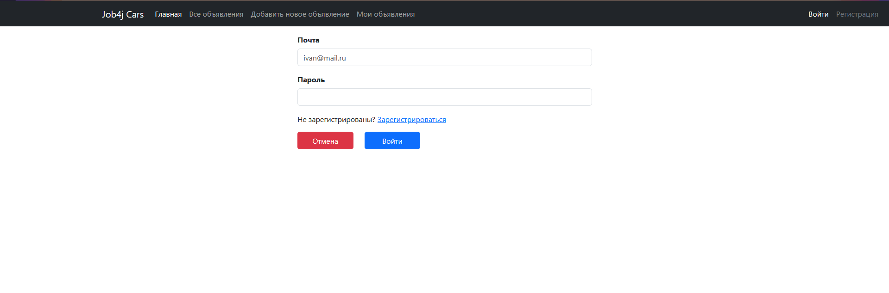
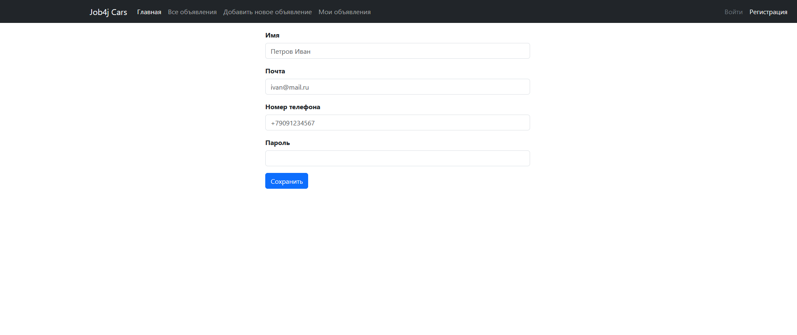
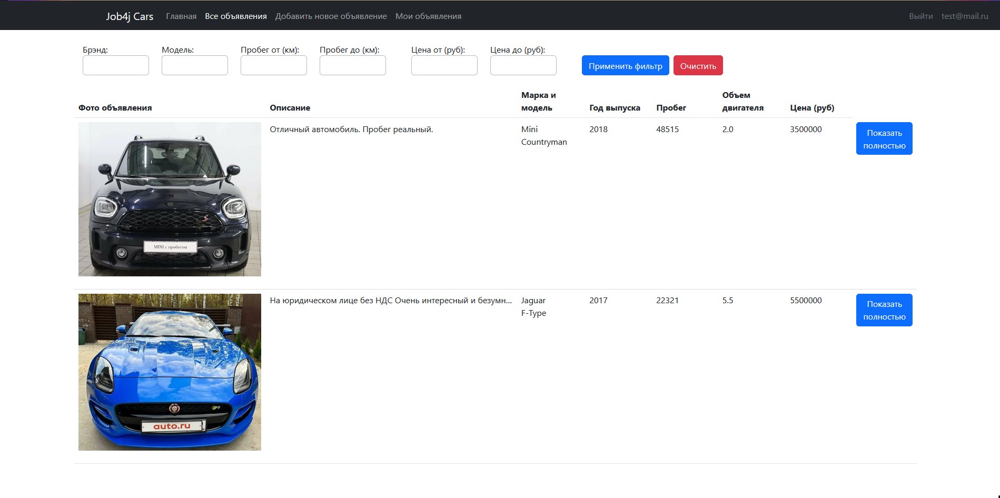
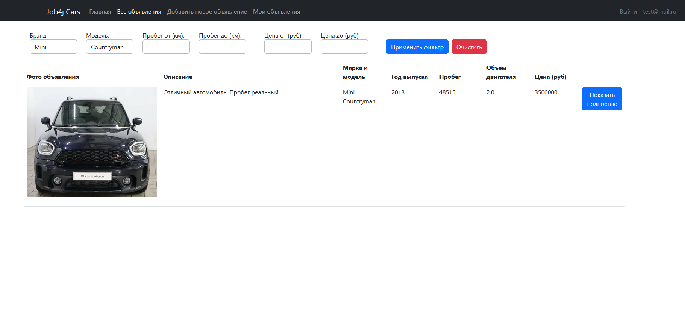
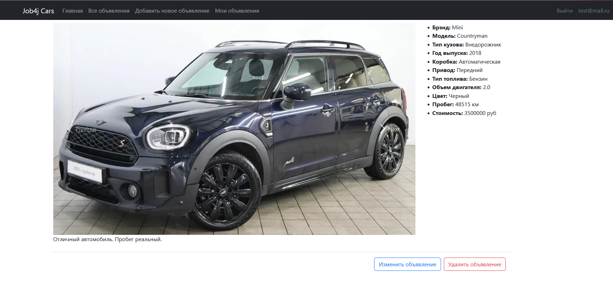
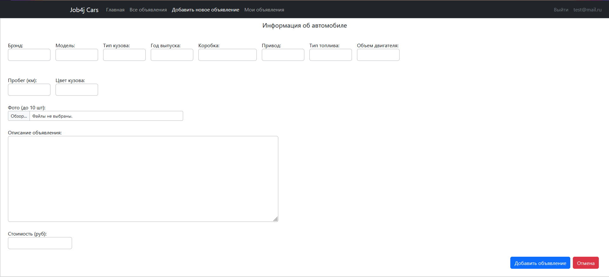
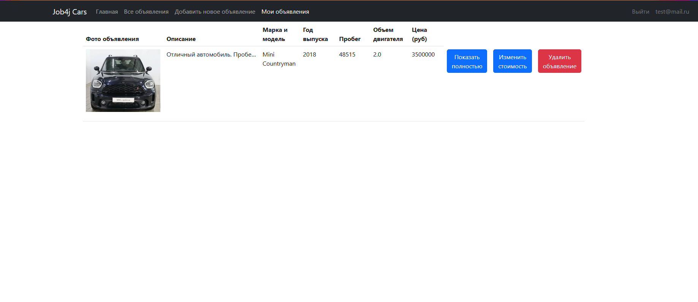
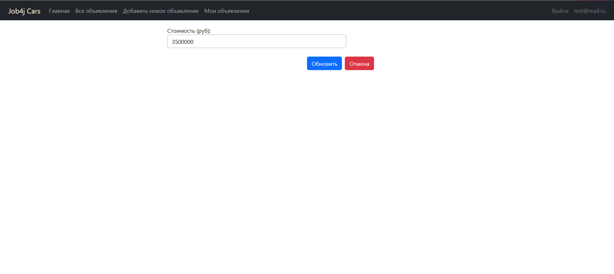

### Job4j_cars

#### Описание проекта:
На сайте присутствуют объявления. В объявлении указано: описание, марка машины, тип кузова, фото.
Объявление имеет статус продано или нет.

#### Стек технологий:
Для реализации проекта использовались: Java 17, Spring Boot 2, Thymeleaf, Bootstrap 5, Hibernate 5.

#### Минимальные требования к окружению:
Для запуска приложения необходимы Java 17, PostgreSQL 14, Maven 3.8.

#### Запуск проекта:
Перед запуском приложения необходимо создать базу данных todo в PostgreSQL 14
с помощью команды ```create database cars```
после чего необходимо запустить скрипты из папки job4j_cars\db\scripts.
Затем необходимо открыть класс job4j_cars\src\main\java\ru\job4j\todo\Main.java и открыть в браузере ссылку localhost:8080/.

#### Взаимодействие с приложением:
В первую очередь откроется страница с входом в систему.
Необходимо будет либо войти с логином и паролем либо придумать логин и пароль и зарегистрироваться.
Без входа в систему будет невозможно работать с приложением.

Страница входа:


Страница регистрации:


После осуществления входа с логином и паролем запускается страница со всеми объявлениями:


В верхней части страницы можно выбрать из выпадающих списков объявления по интересующим брэндам и(или) модели,
а также есть возможность вручную указать диапазон интересующих цен объявлений и(или) пробега.
Чтобы отобразить объявления по указанным запросам, необходимо выбрать интересующие параметры и нажать на кнопку "Применить фильтр".
Чтобы вернуться к полному перечню объявлений, можно нажать на кнопку "Очистить":


При нажатии на кнопку "Показать полностью" справа от объявления, осуществляется переход на страницу с объявлением,
на которой указана основная информация об объявлении, а также можно посмотреть все фотографии объявления.
В случае, если объявление принадлежит вошедшему пользователю, под объявлением будет отображаться две кнопки:
"Изменить объявление" - переходит на страницу для изменения объявления,
"Удалить объявление" - удаляет объявление и осуществляет переход на страницу со всеми объявлениями.


Чтобы добавить объявление нужно перейти на вкладку "Добавить новое объявление".
Откроется страница, в которой нужно выбрать из выбадающих списков Брэнд, Модель, Год выпуска, Коробку передач, Привод, Тип топлива, объем двигателя и Цвет кузова.
Пробег, Описание объявления и Стоимость вводятся вручную.
Также присутствует поле для загрузки фотографий ( на одно объявление можно загружать до 10 фотографий).
Для сохранения объявления необходимо нажать на кнопку с надписью "Добавить объявления".
После этого объявление будет отображаться при переходу по вкладке "Все объявления", а также пользователь может увидеть данное объявление при переходе по вкладке "Мои объявления"
При нажатии на кнопку с надписью "Отмена" задача не сохранится и будет осуществлен переход на страницу со всеми задачами.


При переходе на вкладку "Мои объявления" можно посмотреть на объявление, которые добавил пользователь. 
Напротив каждого объявления присутсвует 3 кнопки: 
"Показать полностью" - осуществляет переход на страницу с объявлением (информация о странице выше),
"Изменить стоимость" -  осуществляет переход на страницу с изменением стоимости,
"Удалить объявление" - удаляет объявление и осуществляет переход на страницу со всеми объявлениями: 


На странице с изменением стоимости присутствует поле, в которое можно ввести с поле новую стоимость объявления,
а также 2 кнопки:
"Обновить" - обновляет стоимость объявления на введенную в поле и осуществляет переход на страницу с объявлениями пользователя,
"Отмена" - оставляет старую стоимость объявления и осуществляет переход на страницу с объявлениями пользователя


#### Контакты
При возникновении вопросов, обращайтесь в телеграм: https://t.me/relaxedlife05